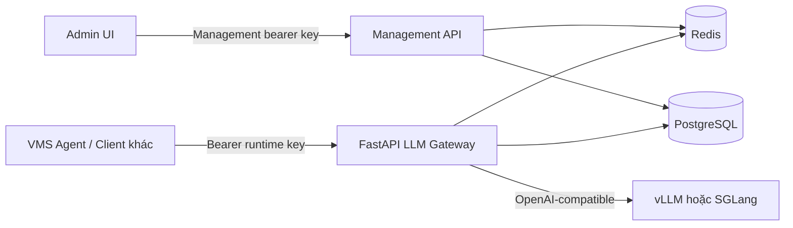
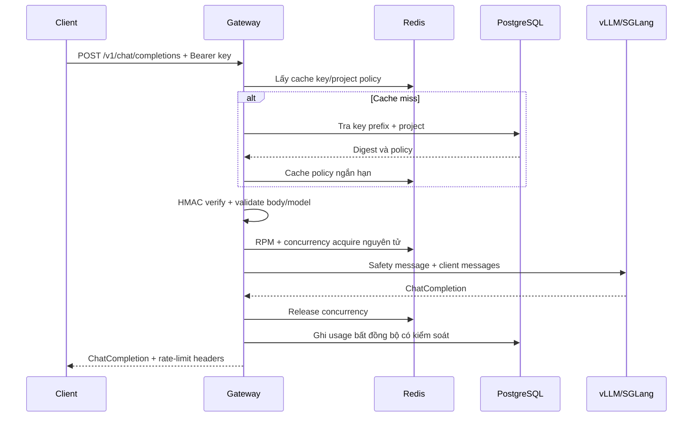
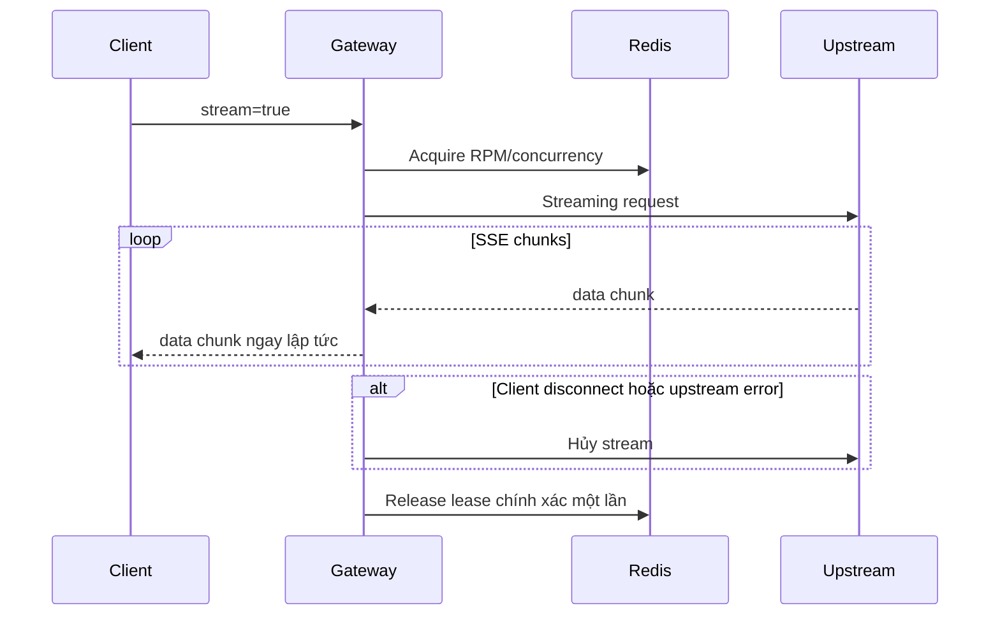

# LLM Gateway dùng chung - Kế hoạch triển khai

## Phase 0: Làm rõ đầu vào

### Bối cảnh đã xác nhận

- Đây là một dự án backend và UI quản trị mới, đặt độc lập tại `/home/atin/apps/llm_gateway`.
- Gateway phục vụ nội bộ, lưu lượng ban đầu thấp nhưng phải cho phép cấu hình hạn mức linh hoạt theo từng project.
- Runtime API dùng FastAPI/Python 3.10+, tương thích OpenAI Chat Completions tại `POST /v1/chat/completions`, gồm response thường và streaming SSE.
- Mỗi ứng dụng tự gửi system prompt và user message. Gateway chỉ chèn một safety policy tối thiểu, không chứa nghiệp vụ.
- Gateway không đăng ký, điều phối hoặc thực thi tool. `tools` và `tool_choice` bị từ chối rõ ràng.
- Một OpenAI-compatible upstream được cấu hình chung; mặc định là vLLM và có thể đổi sang SGLang bằng URL/cấu hình.
- PostgreSQL lưu project, API key, policy và usage; Redis dùng cho cache, rate limit và concurrency.
- Runtime API key riêng cho từng project. Platform Admin quản lý hạn mức/quyền; Client Admin chỉ sửa cấu hình được cấp phép.
- `vms_ai_agent` giữ nguyên tool routing, chỉ bỏ service vLLM nội bộ và đổi sang gọi Gateway.
- UI MVP dùng HTML/CSS/JavaScript tĩnh do FastAPI phục vụ để tránh thêm một toolchain frontend khi chưa cần.

### Ngoài phạm vi MVP

- RAG, vector database, conversation memory và tool execution.
- Responses API, embeddings, image/audio và fine-tuning.
- Billing tiền tệ; chỉ ghi usage token/request.
- Kubernetes, autoscaling GPU và multi-region.
- SSO/OIDC cho trang quản trị; MVP dùng management bearer key và yêu cầu triển khai trong mạng nội bộ/HTTPS.

## Phase 1: Phân tích yêu cầu

### User stories

1. Là Platform Admin, tôi muốn tạo project và giới hạn model/RPM/concurrency/token để chia sẻ GPU an toàn.
2. Là Client Admin, tôi muốn xem cấu hình và usage của project mình nhưng không thể tự nâng giới hạn nền tảng.
3. Là ứng dụng nội bộ, tôi muốn dùng API key và contract Chat Completions quen thuộc để thay backend model mà không đổi nghiệp vụ.
4. Là hệ thống vận hành, tôi muốn thu hồi key, theo dõi request và phát hiện lỗi upstream mà không ghi lộ prompt hoặc secret.
5. Là `vms_ai_agent`, tôi muốn tiếp tục tự gọi VMS tool và chỉ dùng Gateway cho rewrite/synthesis.

### Yêu cầu EARS

| ID | Yêu cầu |
|---|---|
| REQ-01 | WHEN request gọi endpoint runtime THE SYSTEM SHALL yêu cầu Bearer API key hợp lệ và còn active. |
| REQ-02 | WHEN API key hợp lệ THE SYSTEM SHALL ánh xạ request đến đúng project và chỉ cho phép model nằm trong allowlist của project. |
| REQ-03 | WHEN request chứa `messages` hợp lệ THE SYSTEM SHALL chèn safety system message tối thiểu trước messages của client và chuyển tiếp tới upstream. |
| REQ-04 | WHEN request chứa `tools` hoặc `tool_choice` THE SYSTEM SHALL từ chối bằng lỗi OpenAI-compatible `400 unsupported_parameter`. |
| REQ-05 | WHEN `stream=false` THE SYSTEM SHALL trả JSON Chat Completion và giữ các trường tương thích cần thiết từ upstream. |
| REQ-06 | WHEN `stream=true` THE SYSTEM SHALL chuyển tiếp SSE theo thời gian thực, không buffer toàn bộ response. |
| REQ-07 | WHEN project vượt RPM THE SYSTEM SHALL trả `429` và `Retry-After` mà không gọi upstream. |
| REQ-08 | WHEN project vượt concurrency THE SYSTEM SHALL trả `429` hoặc chờ trong giới hạn cấu hình; MVP chọn fail-fast. |
| REQ-09 | WHEN request vượt giới hạn body/context/max_tokens THE SYSTEM SHALL từ chối trước khi gọi upstream. |
| REQ-10 | WHEN upstream timeout/không khả dụng THE SYSTEM SHALL trả lỗi chuẩn hóa `502/504`, không lộ URL, stack trace hoặc upstream key. |
| REQ-11 | WHEN request kết thúc hoặc stream bị hủy THE SYSTEM SHALL giải phóng concurrency slot chính xác một lần. |
| REQ-12 | WHEN Platform Admin tạo API key THE SYSTEM SHALL chỉ trả plaintext key một lần và chỉ lưu digest cùng prefix. |
| REQ-13 | WHEN key bị revoke THE SYSTEM SHALL vô hiệu hóa key sau khi cache hết hạn hoặc bị xóa chủ động. |
| REQ-14 | WHEN Platform Admin cập nhật project THE SYSTEM SHALL kiểm tra optimistic version để tránh ghi đè cấu hình đồng thời. |
| REQ-15 | WHEN Client Admin cập nhật project THE SYSTEM SHALL chỉ cho phép các trường client-editable và không cho tăng hard limit/allowlist. |
| REQ-16 | WHEN runtime request hoàn tất THE SYSTEM SHALL ghi usage tối thiểu gồm project, model, status, latency và token nếu upstream cung cấp. |
| REQ-17 | WHEN ghi log/audit THE SYSTEM SHALL không ghi Bearer token, upstream secret hoặc nội dung messages mặc định. |
| REQ-18 | WHEN health endpoint được gọi THE SYSTEM SHALL phân biệt liveness với readiness của PostgreSQL, Redis và upstream. |
| REQ-19 | WHEN `vms_ai_agent` khởi động THE SYSTEM SHALL gọi Gateway qua URL/API key cấu hình và không phụ thuộc service vLLM trong compose của Agent. |

### Ràng buộc đơn giản hóa

- Một upstream active ở MVP; model alias ánh xạ tới tên model upstream.
- Rate limit fixed-window theo RPM bằng Redis Lua, đủ cho lưu lượng nội bộ; chưa cần sliding window.
- Concurrency dùng semaphore phân tán Redis với lease TTL và request ID; không dùng hàng đợi ưu tiên ở MVP.
- UI không có framework/build step; mọi thao tác gọi Management API.
- Không log prompt để tránh rò rỉ dữ liệu. Debug prompt chỉ bật cục bộ bằng cấu hình rõ ràng và mặc định tắt.

### Nghiên cứu áp dụng

- OpenAI Chat API xác nhận contract `messages`, `model`, `stream` và cấu trúc Chat Completion: <https://developers.openai.com/api/reference/resources/chat>.
- OWASP REST Security khuyến nghị HTTPS, kiểm soát truy cập trên từng endpoint, giới hạn kích thước đầu vào, lỗi không lộ chi tiết, `429` khi quá hạn mức và tách management endpoint: <https://cheatsheetseries.owasp.org/cheatsheets/REST_Security_Cheat_Sheet.html>.
- Redis hướng dẫn dùng kho chung theo API key/tenant và Lua để thao tác rate-limit nguyên tử: <https://redis.io/docs/latest/develop/use-cases/rate-limiter/>.

## Phase 2: Đặc tả kỹ thuật

### Kiến trúc

### Thành phần

- `api/runtime`: Chat Completions, model listing, health và OpenAI-compatible errors.
- `api/management`: project, runtime key, management key, model policy và usage.
- `services/auth`: parse key, tra prefix, so sánh HMAC digest constant-time, cache project policy.
- `services/policy`: validate request, model allowlist, max token và từ chối tool fields.
- `services/limits`: RPM nguyên tử và distributed concurrency lease trên Redis.
- `integrations/upstream`: proxy JSON/SSE tới một OpenAI-compatible backend.
- `repositories`: PostgreSQL persistence qua SQLAlchemy; schema migration bằng Alembic.
- `web`: UI quản trị tĩnh và Playground.
- `observability`: structured logs không chứa secret/prompt, request ID và usage.

### Luồng request thường

### Luồng streaming

### Data model tối thiểu

| Bảng | Trường chính |
|---|---|
| `projects` | `id`, `name`, `status`, `allowed_models`, `rpm`, `max_concurrency`, `max_input_chars`, `max_output_tokens`, `timeout_seconds`, `version`, timestamps |
| `api_keys` | `id`, `project_id`, `kind`, `prefix`, `digest`, `status`, `last_used_at`, `expires_at`, timestamps |
| `model_routes` | `public_name`, `upstream_name`, `enabled` |
| `usage_events` | `request_id`, `project_id`, `model`, `status_code`, `latency_ms`, token counts, timestamp |
| `audit_events` | actor/key ID, action, target, metadata an toàn, timestamp |

`kind` gồm `runtime` và `management`. Platform Admin key bootstrap lấy từ secret môi trường, không lưu plaintext trong DB.

### Runtime contract MVP

- Cho phép: `model`, `messages`, `temperature`, `top_p`, `max_tokens`, `stream`, `stop`, `seed`, `response_format`, `frequency_penalty`, `presence_penalty`, `n`, `user`.
- Bắt buộc: `model`, ít nhất một message có content hợp lệ.
- Từ chối: `tools`, `tool_choice`, audio/image input và các field không được allowlist.
- Gateway chèn safety message ở đầu; client system message được giữ nguyên phía sau.
- Không sửa nội dung output. Response JSON/SSE được proxy, chỉ bổ sung request/rate-limit headers.

### Management API và UI

- `GET/POST /management/v1/projects`
- `GET/PATCH /management/v1/projects/{id}` với `version` chống lost update.
- `POST /management/v1/projects/{id}/keys`, `POST /management/v1/keys/{id}/revoke`.
- `GET /management/v1/projects/{id}/usage`.
- `GET /management/v1/models` và cập nhật model route chỉ dành Platform Admin.
- `/admin` phục vụ UI: tổng quan, project, key, quota, usage, health và Playground.
- UI giữ management key trong bộ nhớ tab, không lưu localStorage/cookie; production phải đặt sau HTTPS/reverse proxy và restricted subnet.

### So sánh phương án

| Hạng mục | Phương án | Ưu điểm | Nhược điểm | Độ phức tạp | Bảo mật | Chọn |
|---|---|---|---|---|---|---|
| Runtime | Proxy trong `vms_ai_agent` | Ít project mới | Coupling VMS, không tái sử dụng | Thấp | Trung bình | Không |
| Runtime | Gateway FastAPI độc lập | Cô lập nghiệp vụ, dùng chung nhiều client | Thêm service vận hành | Trung bình | Cao hơn | Có |
| UI | React SPA riêng | UX và mở rộng tốt | Thêm Node build/deploy | Cao | Trung bình | Chưa |
| UI | HTML/JS tĩnh | KISS, deploy cùng API | UI cơ bản | Thấp | Trung bình | Có |
| Rate limit | In-memory | Rất đơn giản | Sai khi nhiều replica/restart | Thấp | Thấp | Không |
| Rate limit | Redis fixed-window + Lua | Nguyên tử, dùng chung replica | Burst ở biên cửa sổ | Trung bình | Cao | Có |
| Key storage | Plaintext/encrypted reversible | Dễ hiển thị lại | Rủi ro lộ hàng loạt | Thấp | Thấp | Không |
| Key storage | Prefix + HMAC-SHA256 digest | Không khôi phục được secret, verify nhanh | Chỉ hiển thị một lần | Thấp | Cao | Có |
| Upstream | Bind trực tiếp vLLM | Ít cấu hình | Khó thay SGLang | Thấp | Trung bình | Không |
| Upstream | OpenAI-compatible adapter | Đổi backend bằng config | Phải chuẩn hóa khác biệt backend | Thấp | Cao | Có |

### Edge cases

| ID | Tình huống | Điều kiện | Hành vi mong đợi | EARS |
|---|---|---|---|---|
| EC-01 | Thiếu/sai key | Không có Bearer hoặc digest sai | `401 invalid_api_key`, không cho biết prefix có tồn tại | REQ-01 |
| EC-02 | Key hết hạn/revoke | Status không active | `401`, xóa/bỏ qua cache cũ | REQ-01, REQ-13 |
| EC-03 | Model không được phép | Model ngoài allowlist | `403 model_not_allowed` | REQ-02 |
| EC-04 | Messages rỗng/quá lớn | Mảng rỗng hoặc body quá giới hạn | `400/413`, không gọi upstream | REQ-09 |
| EC-05 | Có tool field | `tools` hoặc `tool_choice` xuất hiện | `400 unsupported_parameter` | REQ-04 |
| EC-06 | Quá RPM | Counter vượt limit | `429` + `Retry-After` | REQ-07 |
| EC-07 | Quá concurrency | Không acquire được lease | `429` fail-fast | REQ-08 |
| EC-08 | Client ngắt stream | TCP disconnect | Hủy upstream và release lease | REQ-11 |
| EC-09 | Upstream SSE lỗi giữa chừng | Backend đóng/error | Đóng stream, log status; không thể đổi status sau header | REQ-06, REQ-10 |
| EC-10 | Redis mất | Không kiểm tra hạn mức được | Fail-closed cho runtime để bảo vệ GPU; health degraded | REQ-07, REQ-18 |
| EC-11 | PostgreSQL mất nhưng cache hit | Policy có trong cache | Cho phép trong TTL ngắn; usage fallback log | REQ-01, REQ-16 |
| EC-12 | Cập nhật đồng thời | Hai PATCH cùng version | Một request thành công, request kia `409` | REQ-14 |
| EC-13 | Usage thiếu token | Upstream không trả usage/stream | Lưu token là null, vẫn lưu request/latency | REQ-16 |
| EC-14 | Trùng request ID | Client tái dùng header | Sinh internal event ID riêng; request ID chỉ để trace | REQ-16 |

### Xử lý ngoại lệ

| Nguồn | Ngoại lệ | Khôi phục | Phản hồi client |
|---|---|---|---|
| Validation | Body/schema sai | Không retry | `400/413` OpenAI-style |
| PostgreSQL | Timeout/cache miss | Không thể xác thực nên fail-closed | `503 gateway_unavailable` |
| PostgreSQL | Usage insert lỗi | Structured error log; không làm hỏng response đã sinh | Response model giữ nguyên |
| Redis | Rate-limit/concurrency lỗi | Fail-closed, không gọi GPU | `503 gateway_unavailable` |
| Upstream | Connect timeout | Không retry request sinh để tránh duplicate compute | `504 upstream_timeout` |
| Upstream | 4xx | Chuẩn hóa, không lộ body nhạy cảm | `400/422` phù hợp |
| Upstream | 5xx/network | Không retry tự động trong MVP | `502 upstream_error` |
| Streaming | Lỗi sau khi bắt đầu stream | Hủy và log; release lease trong `finally` | Stream kết thúc |

### Race condition và idempotency

| Tài nguyên | Rủi ro | Giảm thiểu |
|---|---|---|
| RPM counter | Hai replica cùng tăng | Redis Lua `INCR` + TTL nguyên tử |
| Concurrency | Slot rò khi process chết | Lease theo request ID có TTL; release Lua chỉ xóa owner đúng |
| Project config | Lost update | `version` optimistic concurrency và `409` |
| Key revoke/cache | Key còn dùng trong cache | Chủ động delete cache sau transaction; TTL ngắn là lớp dự phòng |
| Tạo key | Client retry tạo nhiều key | Management endpoint hỗ trợ `Idempotency-Key` lưu kết quả ngắn hạn |
| Usage event | Ghi lặp | Unique internal event ID/request execution ID |

## Phase 3: Kế hoạch triển khai

### Phân loại

- `llm_gateway`: dự án mới, 5 phase.
- `vms_ai_agent`: tích hợp/thay đổi cấu hình nhỏ trên dự án hiện hữu.
- Kiểm thử: pytest tích hợp, upstream/Redis/DB dùng fake hoặc mock ở unit test; Docker smoke test cho dependency thật khi môi trường cho phép.

### Task hierarchy và ước lượng

#### Giai đoạn 1 — Acceptance tests và cấu trúc (45 phút)

1. **Viết test contract runtime (20 phút)**
   - Files: `tests/test_chat_completions.py`, `tests/conftest.py`.
   - Tối thiểu: test key, prompt injection order, model allowlist, tool rejection, non-stream và stream.
   - Verify: `pytest tests/test_chat_completions.py`; ban đầu fail vì chưa có implementation.
   - Trace: REQ-01..REQ-11.
2. **Tạo skeleton/config (15 phút)**
   - Files: `pyproject.toml`, `app/**`, `resources/configs/app.yaml`, `.env.example`.
   - Verify: import `app.main` thành công.
3. **Tạo schema migration (10 phút)**
   - Files: `alembic.ini`, `migrations/**`, models.
   - Verify: Alembic upgrade trên DB test.

#### Giai đoạn 2 — Core runtime (70 phút)

1. **API key auth và policy cache (20 phút)**
   - Verify: tests key active/invalid/revoke pass.
2. **Rate limit và concurrency Redis (20 phút)**
   - Verify: tests nguyên tử và release-on-error/disconnect pass.
3. **Request policy và safety prompt (15 phút)**
   - Verify: tool fields bị từ chối; client system prompt được giữ sau safety prompt.
4. **Upstream JSON/SSE proxy (15 phút)**
   - Verify: MockTransport xác nhận body/header và chunk streaming không buffer.

#### Giai đoạn 3 — Management và UI (60 phút)

1. **Management API (25 phút)**
   - Verify: role scope, project CRUD, optimistic version và one-time key output.
2. **Usage/audit (15 phút)**
   - Verify: không ghi prompt/secret; usage query đúng project.
3. **Admin UI/Playground (20 phút)**
   - Verify: static assets load, API calls gửi management bearer, không dùng localStorage.

#### Giai đoạn 4 — Tích hợp VMS Agent và Docker (35 phút)

1. **Tách vLLM khỏi Agent compose (10 phút)**
   - Files: `vms_ai_agent/docker-compose.yml`, `.env.example`, `README.md`.
   - Verify: `docker compose config` không còn `model-serving`.
2. **Cấu hình Agent gọi Gateway (10 phút)**
   - Files: config/env và integration tests liên quan.
   - Verify: mock Gateway nhận Bearer Gateway key và contract JSON hiện tại.
3. **Docker Compose Gateway (15 phút)**
   - Files: `Dockerfile`, `docker-compose.yml`, healthcheck.
   - Verify: `docker compose config`; smoke test khi có image/dependency.

#### Giai đoạn 5 — Validation và tài liệu (45 phút)

1. **Chạy unit/integration test và coverage (15 phút)**
   - Verify: toàn bộ test pass, core module coverage mục tiêu >=90%.
2. **Chạy regression `vms_ai_agent` (10 phút)**
   - Verify: `pytest` hiện hữu pass.
3. **Kiểm tra bảo mật và review diff (10 phút)**
   - Verify: không secret hard-code, không prompt/key trong logs, review PASS.
4. **README/API examples/runbook (10 phút)**
   - Verify: lệnh khởi động, bootstrap, tạo project/key và curl chat chạy theo tài liệu.

### Ma trận truy vết

| Nhóm yêu cầu | Thành phần | Test |
|---|---|---|
| REQ-01..REQ-04 | auth, policy, schemas | `test_auth.py`, `test_chat_completions.py` |
| REQ-05..REQ-06 | upstream proxy | JSON và SSE integration tests |
| REQ-07..REQ-11 | Redis limits, lifecycle | `test_rate_limits.py`, disconnect/error tests |
| REQ-12..REQ-15 | management API/repository | `test_management.py` |
| REQ-16..REQ-18 | usage, logs, health | `test_usage_health.py` |
| REQ-19 | VMS Agent config/adapter | regression trong `vms_ai_agent/tests/test_integrations.py` |

### Tiêu chí hoàn thành

- Contract Chat Completions non-stream và SSE hoạt động với OpenAI-compatible upstream.
- Runtime/management keys tách quyền, plaintext secret chỉ xuất hiện một lần.
- Hard limit, allowlist, RPM và concurrency được enforce trước upstream.
- Tool fields bị từ chối; Gateway không chứa nghiệp vụ VMS.
- UI quản lý project/key/quota/usage và Playground dùng được.
- `vms_ai_agent` không còn container vLLM và regression test pass.
- README, `.env.example`, migration và Docker Compose đầy đủ; không chứa secret thật.

